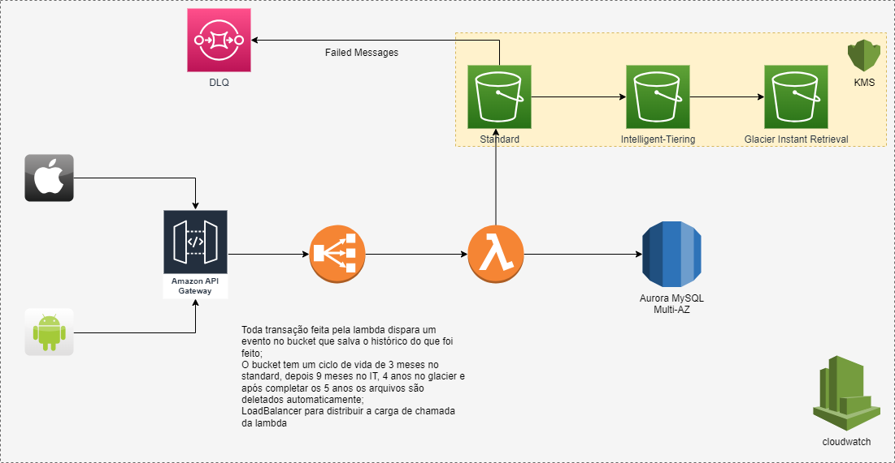

# TransacaoFinanceira
Esse projeto está sendo executado no .NET 7.0; 

Foi implementado algumas mensagens de saída para validar quais os valores iniciais e quais os finais. 
O projeto ficou separado em models e services. 

