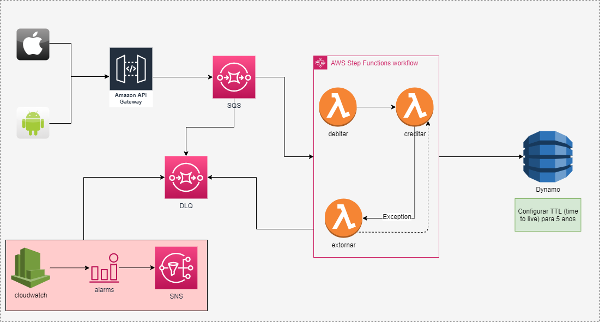

# Teste Transacao Financeira SR
Esse projeto está sendo executado no .NET 7.0; 

Foi implementado algumas mensagens de saída para validar quais os valores iniciais e quais os finais. 
O projeto ficou separado em models e services. 
O projeto contém uma solution que une os projetos: o principal e os testes. 

### 

# Arquitetura inicial

# Sugestão para a arquitetura 

+ Desacoplamento na utilização do SQS para recebimento das requisições no api gateway 
+ Step function possibilita separar as transações, deixando individualizado cada ação
+ Cloudwatch monitarando as requisições e enviando alarme via SNS
+ Ciclo de vida do S3 para salvar o histórico por 5 anos

